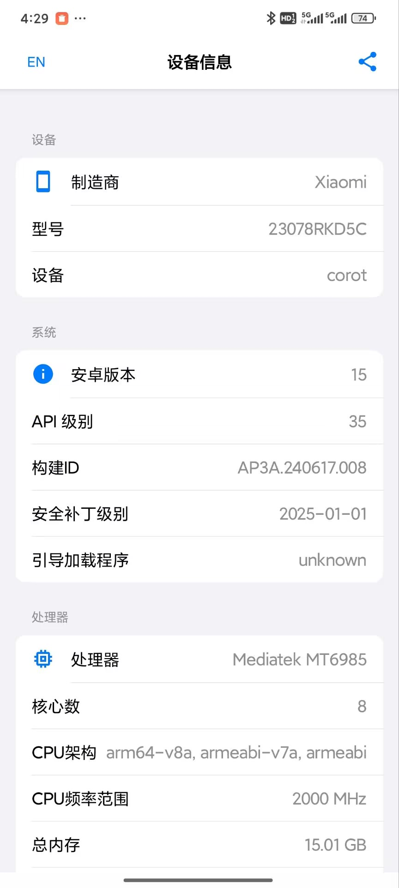

# 设备信息 (Device Info)

一个简洁、美观的Android应用，用于收集和展示设备的详细信息，支持中英文界面切换和信息分享功能。主要适用于开发者需要你提供设备信息的场景

### **导出的json文件比显示的信息更加完整**
## 功能特点

- **全面的设备信息**：显示设备的制造商、型号、系统版本等基本信息，以及CPU、内存、存储、网络等详细信息
- **多语言支持**：支持中文和英文界面，可随时切换
- **信息分享**：一键分享设备信息到其他应用
- **信息导出**：可将设备信息导出为JSON文件保存到本地
- **类别选择**：可选择要导出的信息类别
- **iOS风格界面**：采用简洁、美观的iOS风格界面设计

## 技术实现

- **开发语言**：Kotlin
- **UI框架**：Jetpack Compose
- **架构**：MVVM架构
- **本地化**：支持中英文本地化
- **文件处理**：使用FileProvider实现文件分享
- **权限管理**：适配Android各版本的权限请求

## 应用截图

## 信息类别

应用收集并展示以下类别的设备信息：

- **基本设备信息**：制造商、型号、设备名等
- **系统信息**：Android版本、API级别、安全补丁等
- **内核信息**：内核版本、架构等
- **基带信息**：基带版本、SIM卡信息等
- **屏幕信息**：分辨率、像素密度等
- **内存信息**：总内存、可用内存等
- **存储信息**：内部存储、外部存储等
- **CPU信息**：处理器、核心数、架构等
- **网络信息**：IP地址、MAC地址等
- **电池信息**：电池电量、状态、健康度等

## 安装要求

- Android 5.0 (API级别21)或更高版本
- 约10MB的存储空间

## 权限说明

应用需要以下权限才能正常工作：

- `READ_PHONE_STATE`：读取设备IMEI、序列号等信息
- `ACCESS_NETWORK_STATE`：获取网络状态信息
- `INTERNET`：获取网络相关信息
- `READ_EXTERNAL_STORAGE`/`WRITE_EXTERNAL_STORAGE`：导出信息到存储设备

## 使用方法

1. 安装并启动应用
2. 浏览各类设备信息
3. 点击右上角的分享按钮，将信息分享给其他应用
4. 点击底部的导出按钮，将信息保存为JSON文件
5. 点击左上角的语言切换按钮，切换界面语言

